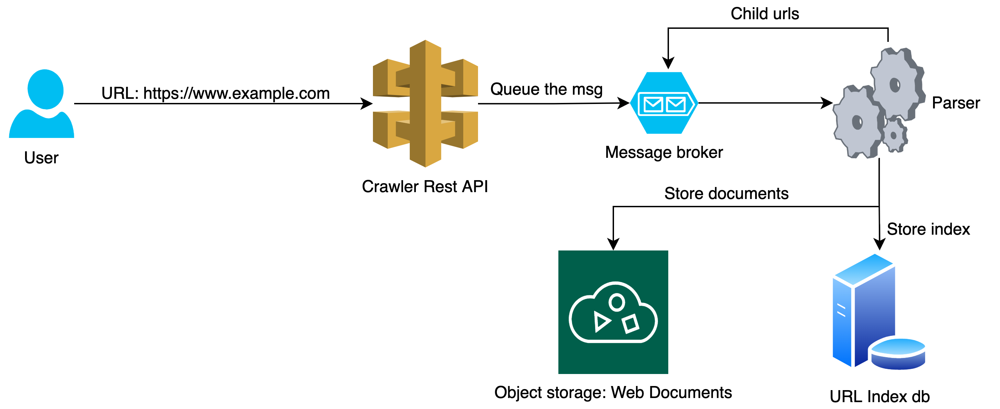

# Web Crawler
Web Crawler

## Modules
* Crawler common
* Crawler core
* Crawler web

## Dependencies
Couchbase database: https://www.couchbase.com/downloads
MinIO: https://min.io/download
Kafka and Zookeeper: https://kafka.apache.org/

## How to run
VM Argument: -Dspring.config.location=/<FULL PATH>/config/

